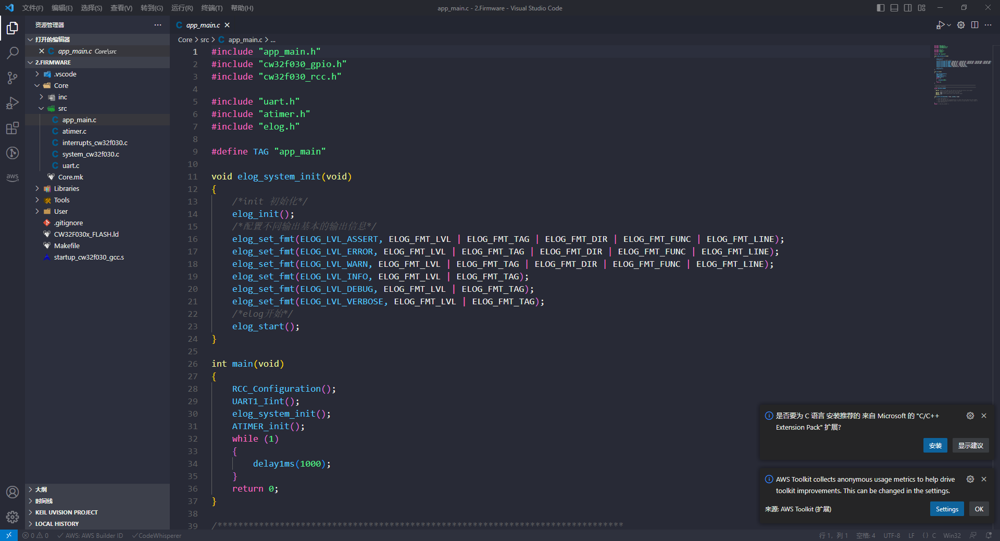

# 项目介绍
这是个利用PD协议实现的恒温加热台，主控采用CW32F030，这个是国产32，有幸免费样品申请，申请到了所有用其作为主控制作一个项目。项目主要借鉴来源于[oshwhub.com](https://oshwhub.com/littleoandlittleq/bian-xie-jia-re-tai)

# 软件架构
开发环境 VScode+gcc编译开发环境，

# 调试过程记录

## 2023年7月26日

基础工程模板搭建，采用easylogger日志系统，便于log调试。整体工程采用VScode+GCC搭建开发环境，jlink调试。

