# 项目介绍
这是个利用PD协议实现的恒温加热台，主控采用CW32F030，这个是国产32，有幸免费样品申请，申请到了所有用其作为主控制作一个项目。项目主要借鉴来源于[[PD协议 | 高颜值\]mini加热台 - 嘉立创EDA开源硬件平台 (oshwhub.com)](https://oshwhub.com/littleoandlittleq/bian-xie-jia-re-tai)

# 软件架构
开发环境 VScode+gcc编译开发环境，

# 制作过程记录

## 2023年7月26日

基础工程模板搭建，采用easylogger日志系统，便于log调试。整体工程采用VScode+GCC搭建开发环境，jlink调试。

## 2023年7月27日

PWM部分调试完成，可以设置不同频率，占空比的PWM。

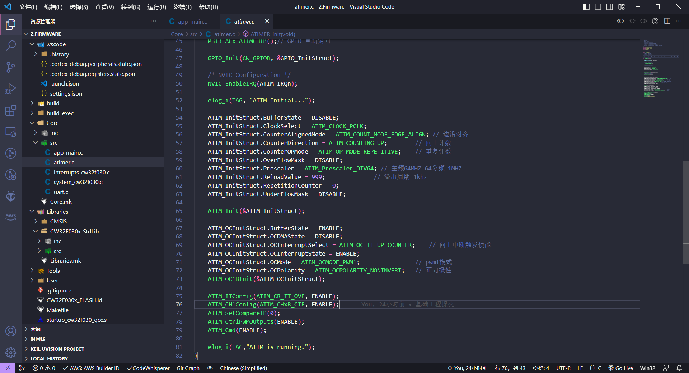

## 2023年7月29日

完成外部中断，adc部分调试，规划设计路线

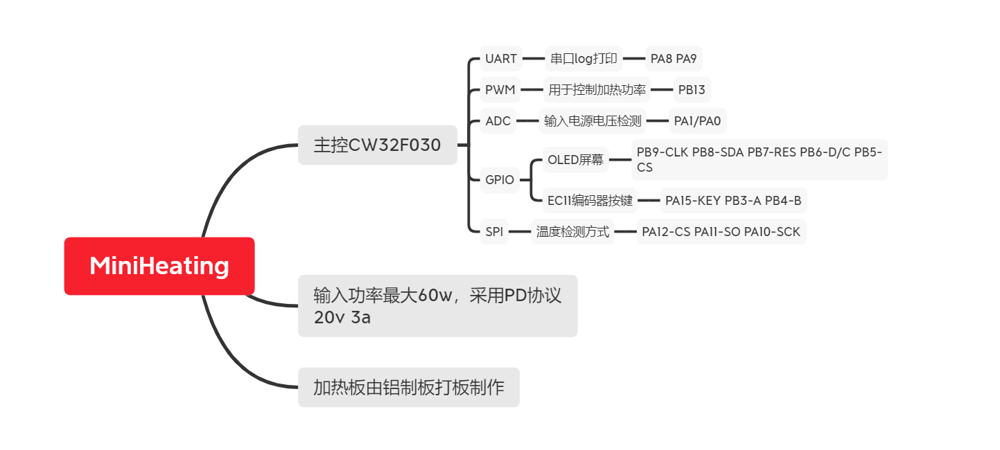

## 2023年8月3日

调通oled外设，ec11按键逻辑编写完成

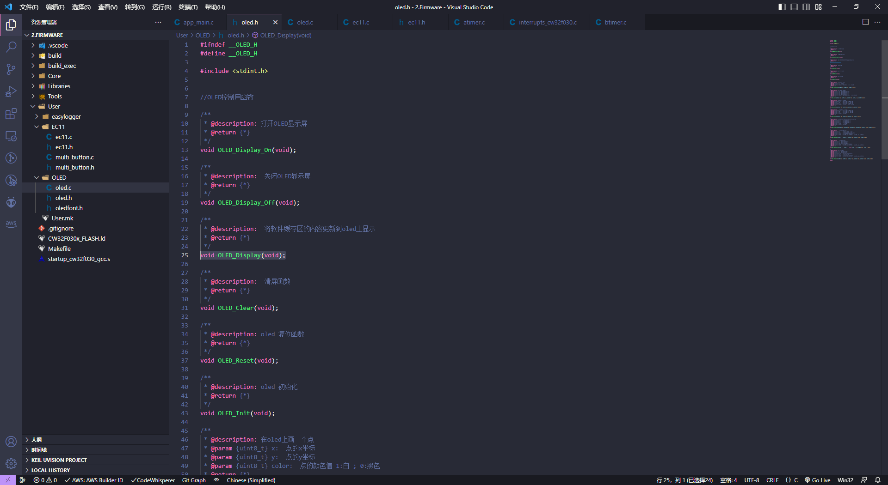

## 2023年8月5日

开机过渡动画设计完成。

## 2023年8月6日

完成控制板pcb制作

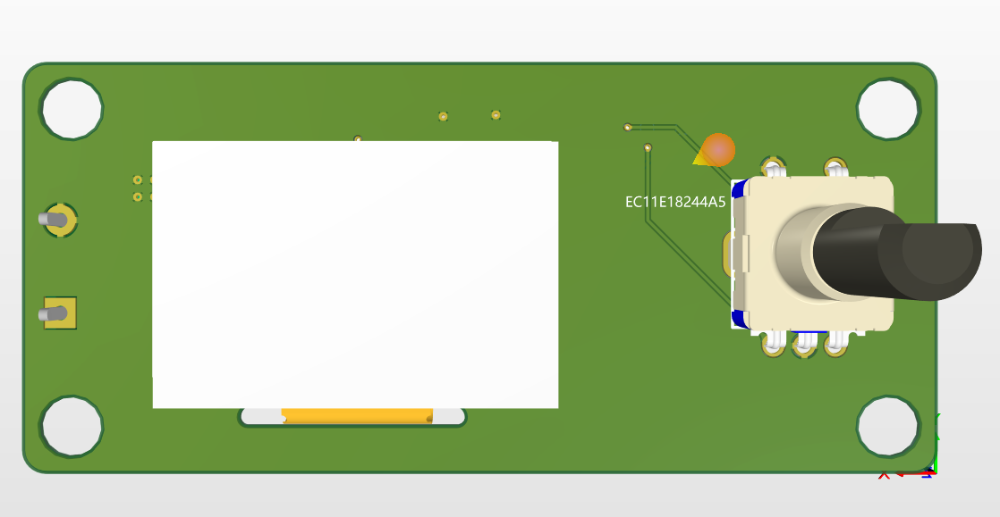

## 2023年8月13日

完成控制板焊接，所有外设适配调试工作，后续计划设计逻辑，将相关功能结合到一起

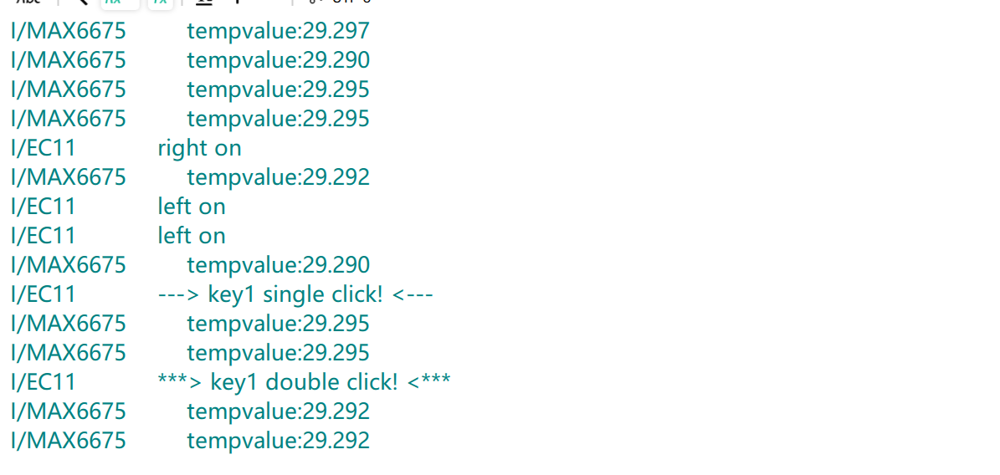

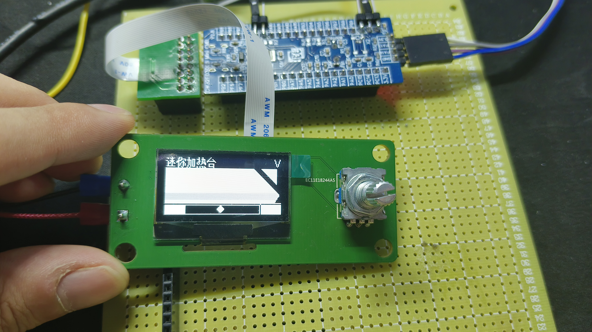

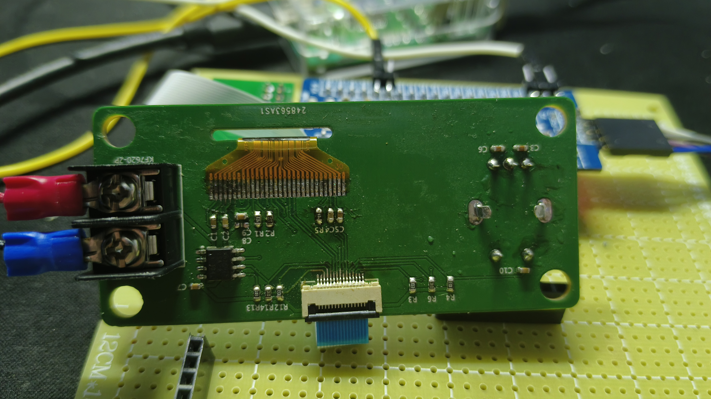

## 2023年8月20日

主板原理图设计完成，mos驱动方法待定，将两个方案电路均画在原理图上，在焊接时自行选择

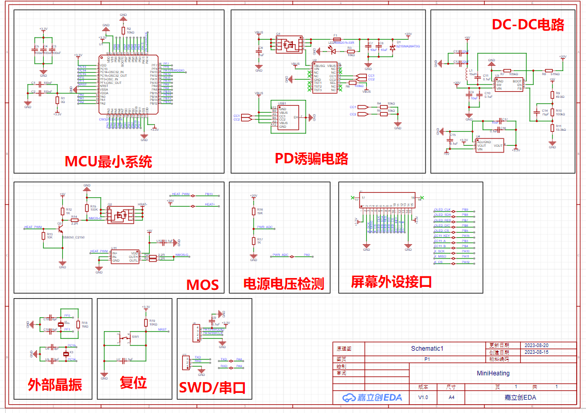

重新整理了一下规划表

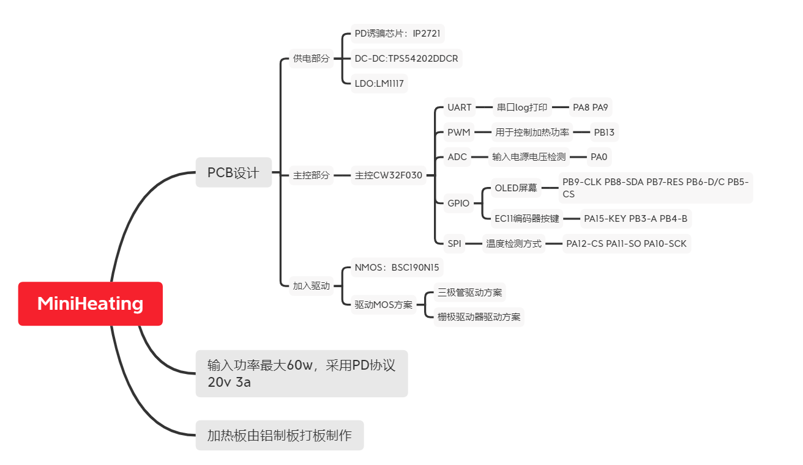

## 2023年8月26日

PCB制作完成，已发板，后续焊接调试

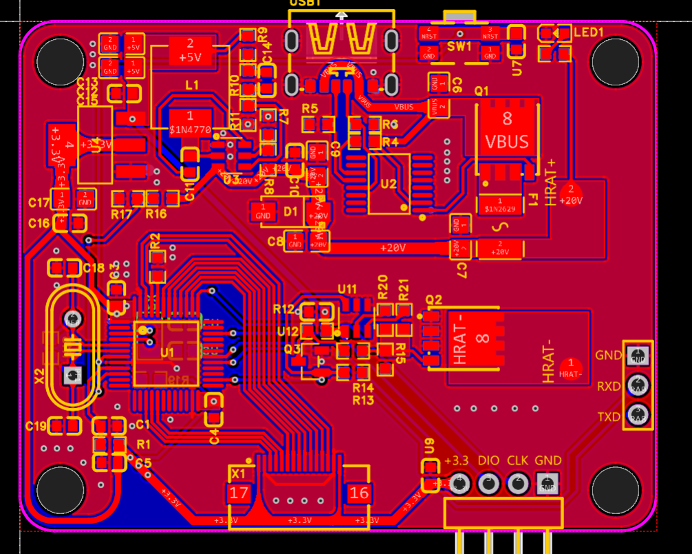

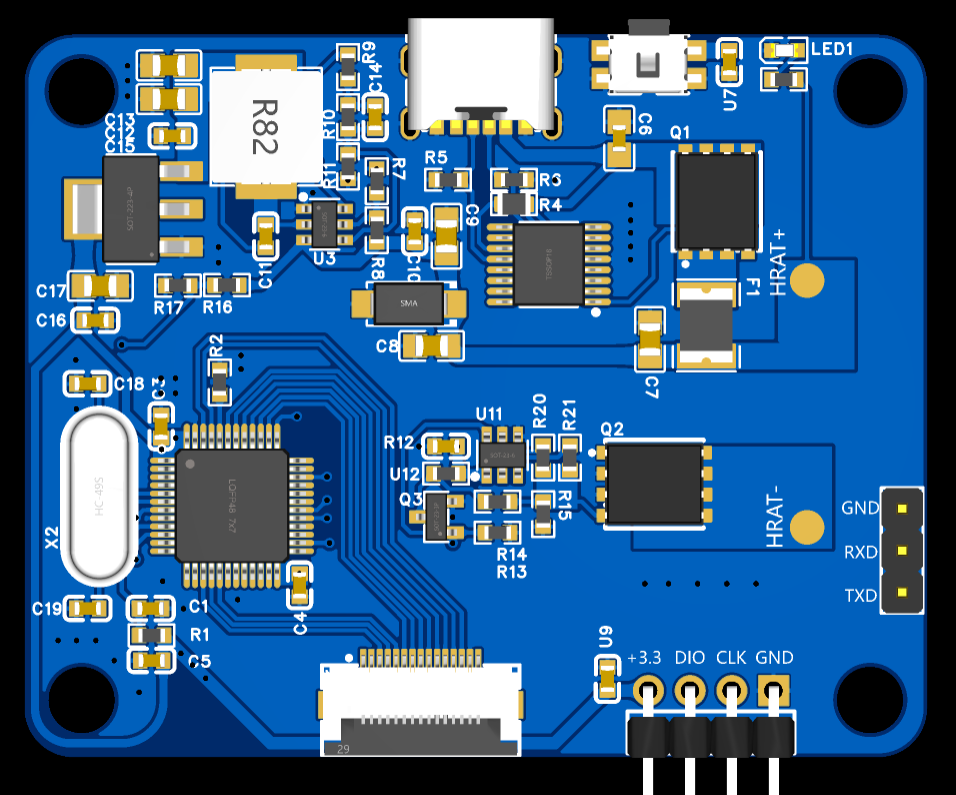

## 2023年9月1日

完成硬件焊接和测试，大体上没有问题，待测试下加热驱动能否可行

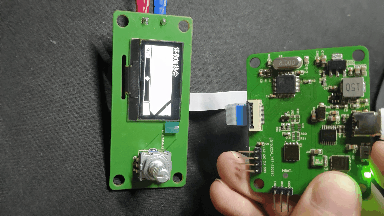

## 2023年9月3日

梳理一下代码主要流程，方便后续代码编写方向；

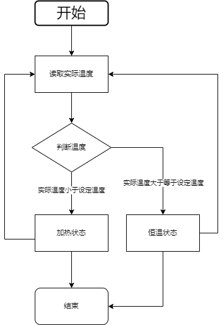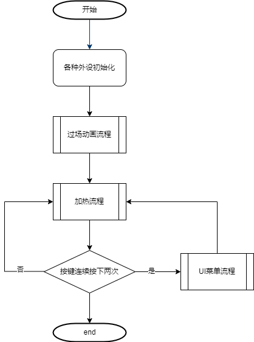

## 2023年9月9日

加热界面设计完成

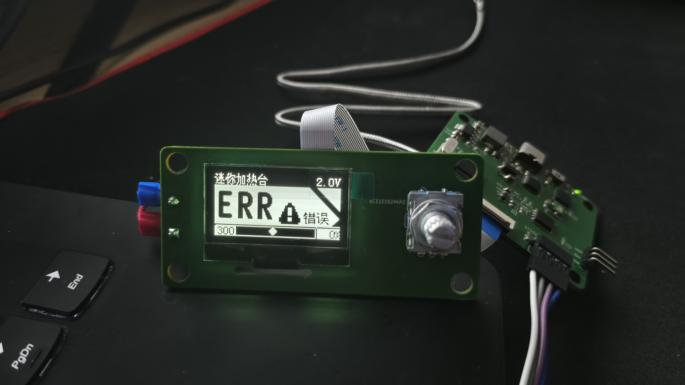

